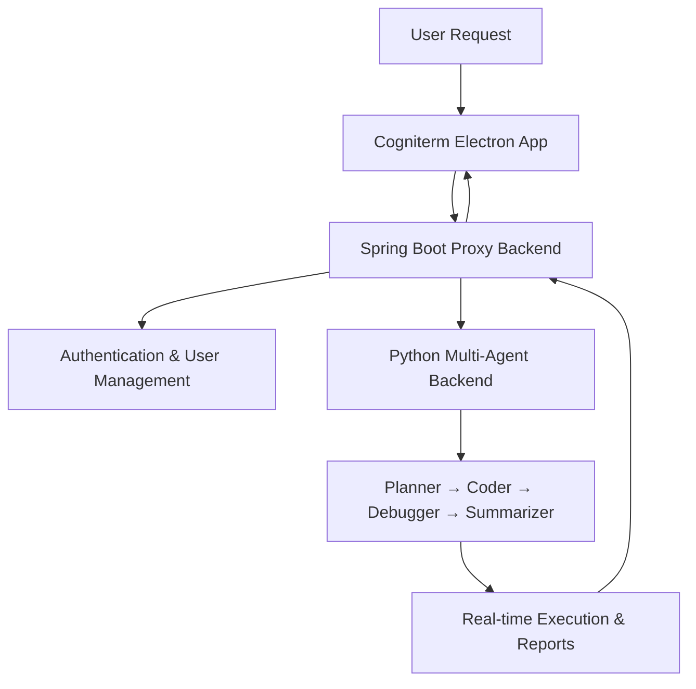

# Multi-Agent Orchestration System

A LangGraph-based multi-agent system that decomposes complex user requests into executable steps, generates code, handles debugging, and produces concise reports. This monorepo includes the core **Python backend**, a **Spring Boot proxy backend** for authentication and user management, and a **Cogniterm** desktop frontend built with Electron.

## Features

- **Planner Agent**: Breaks down natural language requests into atomic steps  
- **Step Manager**: Orchestrates workflow execution and validation  
- **Coder Agent**: Generates executable code for each step  
- **Debugger Agent**: Fixes code when errors occur  
- **Summarizer Agent**: Produces final reports after all steps complete  
- **Authentication & User Management**: Secure login, session handling, and user persistence via Spring Boot + PostgreSQL  

## System Architecture



## Components

### Python Backend (`Cogniterm_Agents`)
Core AI orchestration engine with agent workflow, code generation, and execution.

- Hosted at: `http://13.53.125.55`
- WebSocket: `ws://13.53.125.55/ws`

> Example:  
> `scan my local network for Android devices` → discovers network, scans hosts, identifies Android devices, generates report.

---

### Spring Boot Proxy Backend
Acts as a secure gateway between the Electron frontend and Python backend.

- Handles **user authentication**, **JWT sessions**, and **rate limiting**
- Persists user data and request history in **PostgreSQL**
- Forwards authenticated requests to the Python backend
- Streams real-time updates via WebSocket

---

### Frontend: Cogniterm (Electron Desktop App)
Cross-platform terminal-style interface with real-time execution feedback.

- Built with **Electron + xterm**
- Supports **Windows, macOS, Linux**
- Live ANSI-colored output rendering
- Secure login flow via Spring Boot
- Real-time progress streaming over WebSocket

#### Key Dependencies
| Dependency       | Purpose |
|------------------|--------|
| **xterm**        | Terminal UI |
| **mathjs**       | Math in generated code |
| **ansi-up**      | ANSI → HTML rendering |
| **Electron**     | Desktop framework |

---

## Hosted Services

| Service               | URL |
|-----------------------|-----|
| Python Backend API    | `http://13.53.125.55` |
| WebSocket (Python)    | `ws://13.53.125.55/ws` |
| Spring Boot Proxy     | Available in deployment (configurable) |

---

## License
MIT License - see [LICENSE](LICENSE) for details.

## Support
- Report issues in the [Issues](https://github.com/your-repo/issues) section  
- Test connectivity via WebSocket or frontend app
```
