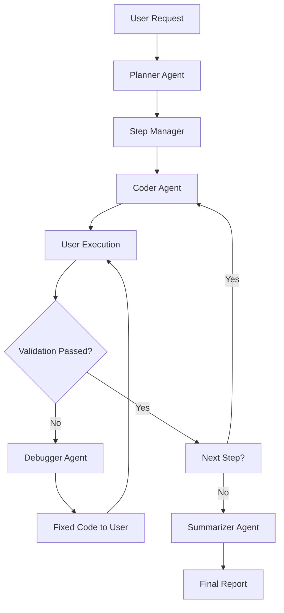

# Multi-Agent Orchestration System

A LangGraph-based multi-agent system that decomposes complex user requests into executable steps, generates code, handles debugging, and produces concise reports. This monorepo includes the core backend and a desktop frontend application (**Cogniterm**) built with Electron.

## Features

- **Planner Agent**: Breaks down natural language requests into atomic steps
- **Step Manager**: Orchestrates workflow execution and validation
- **Coder Agent**: Generates executable code for each step
- **Debugger Agent**: Fixes code when errors occur
- **Summarizer Agent**: Produces final reports after all steps complete

## System Architecture



## Components

### Backend
The core API and WebSocket server handling agent orchestration, code generation, and execution.

#### Installation
1. Navigate to the `Cogniterm_Agents` directory
2. Clone this repository (if not already done)
3. Install dependencies:
   ```bash
   pip install -r requirements.txt
   ```

#### Usage
```python
from main import MultiAgentOrchestrator

# Initialize the orchestrator
orchestrator = MultiAgentOrchestrator()

# Execute a request
result = orchestrator.execute_request("scan my local network for Android devices")
print(result)
```

#### Hosted Backend
The backend is hosted on AWS and can be accessed at:

[http://13.53.125.55](http://13.53.125.55)

You can also connect to the WebSocket endpoint using:
```bash
wscat -c ws://13.53.125.55/ws
```

#### Example
For the request *"scan my local network for Android devices"*, the system:
1. Identifies the local network range
2. Scans for active hosts
3. Identifies Android devices
4. Generates a comprehensive report

### Frontend: Cogniterm (Electron Desktop App)
A cross-platform desktop application (Windows, macOS, Linux) built with Electron, featuring a terminal-like interface (powered by xterm) for submitting natural language requests, monitoring real-time execution progress, and viewing generated reports. It connects to the backend via HTTP API and WebSocket for live updates.

#### Installation
1. Navigate to the `/Cogniterm_Electron` directory
2. Install dependencies:
   ```bash
   npm install
   ```

#### Usage
1. For development (with hot reload):
   ```bash
   npm run dev
   ```
2. To run the built app:
   ```bash
   npm start
   ```
3. Launch the app, enter a natural language request (e.g., *"scan my local network for Android devices"*) in the terminal interface, and submit to interact with the backend. Progress and reports will stream in real-time.

#### Building for Distribution
Build standalone executables for your platform:
```bash
npm run build
```
- Outputs to `dist_build/` directory
- Supports Linux targets: AppImage and DEB (configurable in `package.json`)

#### Key Dependencies
| Dependency | Purpose |
|------------|---------|
| **xterm** | Terminal emulator for the UI |
| **mathjs** | Handles mathematical computations in generated code |
| **ansi-to-html / ansi-up** | Renders ANSI-colored output in the interface |
| **Electron** | Cross-platform desktop framework |

## License
MIT License - see [LICENSE](LICENSE) for details.

## Support
- Report issues in the [Issues](https://github.com/your-repo/issues) section
- For questions, open a discussion or test via the WebSocket endpoint
